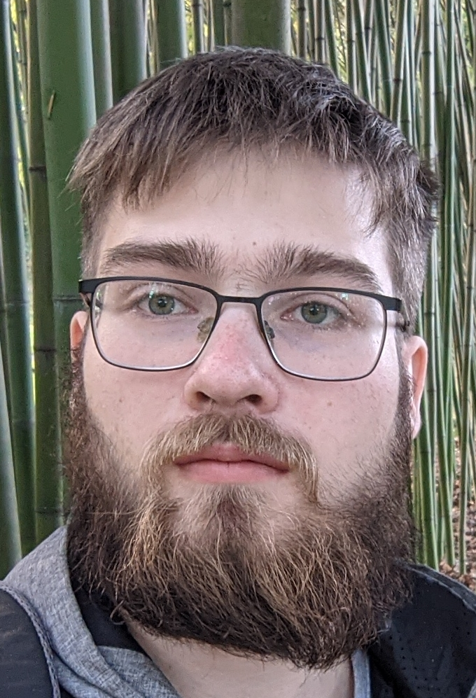
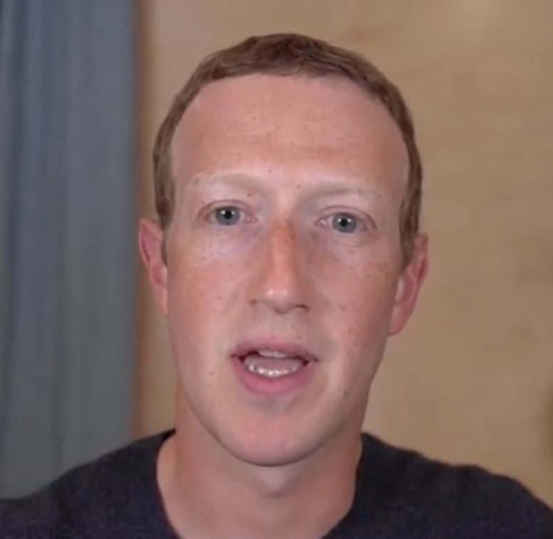
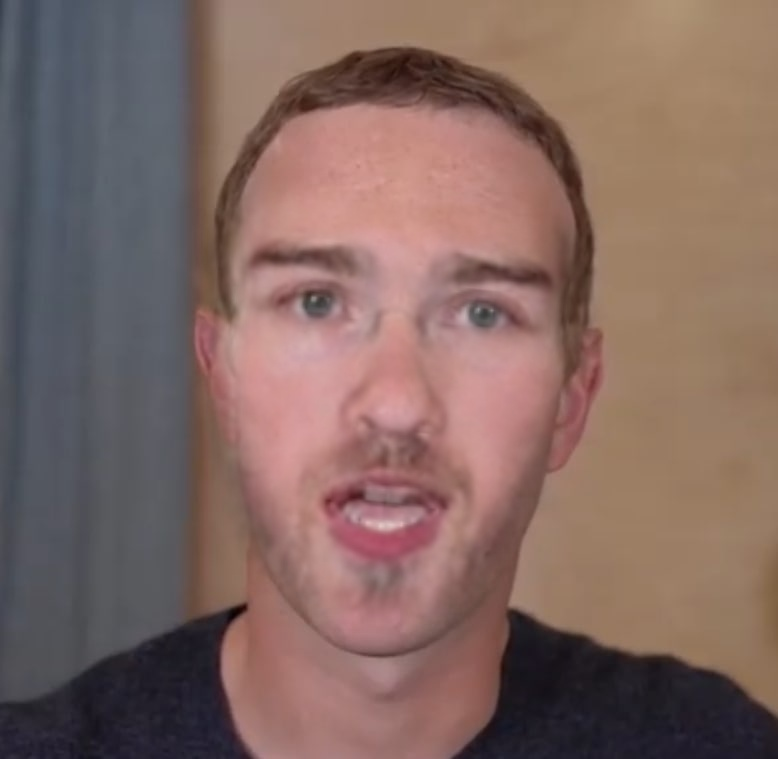

# Задание 3
Мерзляков Илья, группа 20213

## 1. Где расположен код модели, кто разработчик
Разработчик модели - Сбербанк, код расположен на [Гитхабе](https://github.com/ai-forever/ghost)
# 2. Статья
У авторов есть [публикация](https://ieeexplore.ieee.org/abstract/document/9851423) и [статья на хабре](https://habr.com/ru/companies/sberbank/articles/645919/).

## Суть подхода авторов
Суть подхода авторов - взять уже существующие модели и улучшить их.  
Основные шаги обработки изображения:
1. Найти и вырезать лица с  source (лицо, которое будем вставлять)(Xs) и target (картинка/видео, куда вставляем)(Xt) изображений.
3. С помощью модели ArcFace извлечь из Xs identity признаки (черты лица)
3. С помощью другой модели извлечь из Xt атрибутивные признаки
7. Смешать атрибутивные и identity вектора признаков
2. Получить изображение человека, которое сохраняет identity из source и атрибуты из destination
7. Вставить полученное изображение в target

## Обучение
Модель была обучена на датасете VGGFace2, из которого убрали все изображения разрешения менее 256x256. Модель обучалась в 2 этапа, на первом не учитывалась функция потерь глаз, на втором наоборот, учитывалась с большим коэффициентом. Модель тренировалась 12 эпох.

## Метрики
| method             | ID retrieval | shape_ringnet | exp_ringnet | pose_ringnet | poseHN  | eye_ldmk |
|--------------------|--------------|---------------|-------------|--------------|---------|----------|
| FaceSwap (2017)    | 58.82        | 0.75          | 0.305 💥    | 0.045        | 1.94    | 4.22     |
| DeepFakes (2018)   | 72.42        | 0.65          | 0.696       | 0.110        | 7.35    | 11.6     |
| FaceShifter (2019) | 82.02        | 0.67          | 0.420       | 0.040        | 1.93 💥 | 2.48     |
| SimSwap (2021)     | 87.42        | 0.72          | 0.340       | 0.035 💥     | 2.13    | 2.91     |
| HifiFace (2021)    | 89.17        | 0.64 💥       | 0.510       | 0.048        | 2.13    | 2.04     |
| **Ghost 💥**       | 90.61 💥     | 0.64 💥       | 0.436       | 0.047        | 2.26    | 2.02 💥  |

# 3. Части модели
Модель состоит из нескольких частей:
* insightface - вырезка лиц из картинок
* AEI_Net - основная модель
* netArc - arcface модель для получения эмбеддингов лиц
* handler - модель для получение face landmark'ов (расположения ключевых точек на лице)
* pix2pix - модель для увеличения разрешения выходного изображения (используется опционально)

# 4. Инференс
Инференс для видео, насколько я понял, производится для каждого кадра отдельно как для фотографии.
1. В функцию ```model_inference``` передаются необрезанные кадры, куда нужно вставить лицо, обрезанное и выравненное аффинным преобразованием лицо-источник, а также (опционально) выравненной лицо, которое нужно заменять (для случая, если в таргете несколько людей)
1. Из таргет фреймов вырезаются и выравниваются лица, похожие на указанное (или первое попавшееся), все обрезанные изображения обрезаются до 224х224, нормализуются и уменьшаются в 2 раза
1. Лица кормятся модели
1. В результате получается такое же обрезанное лицо, которое проходит обратные преобразования
1. (Опционально) результат увеличивают в разрешении другой моделью
1. Результат накладывается на целевое изображение по полупрозрачной маске (она построена на положении найденных ранее основных элементов лица)
1. (Для видео) картинки склеиваются в видео, в него копируется звук исходного видео

# 5. Дообучение
Да, модель можно дообучить, для этого требуется датасет VGGFace2.
Да, авторы давали советы по дообучению:
* Менять коэффициенты функций потерь для определения, на какое из двух входных лиц будет похоже лицо в результате

# 6. Мои результаты
Я не использовал ноутбук и коллаб, а запускал модель локально с помощью ```inference.py```. Необходимое окружение можно получить в докере (Dockerfile прилагается).

* Source: 
## Фото:
* Target: 
* Result: 
## Видео
Пришлось уменьшить batch size до 10 (по умолчанию 40), а то не хватало видеопамяти (10 GB)
* Target: 
* Result: 